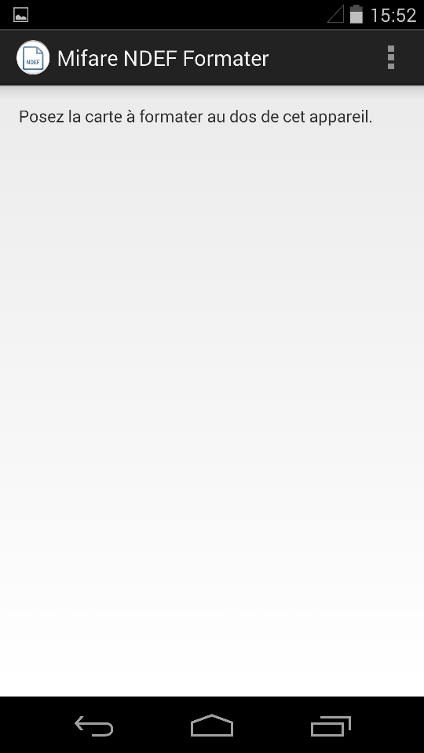

MifareNDEFFormater
==================

Smartcard formatting application. Designed for Biocard project. It is a final-year project side application.

In Biocard proof-of-concept application, we use Mifare-type NFC cards. We needed them to be compatible with the fingerprints format. 
So we made this little tool the enabled Mifare-type NFC cards with our application. 
It is a simple Android application that exchanges data with the NFC card that needs to be enabled. It is incredibly fast and easy to use.

